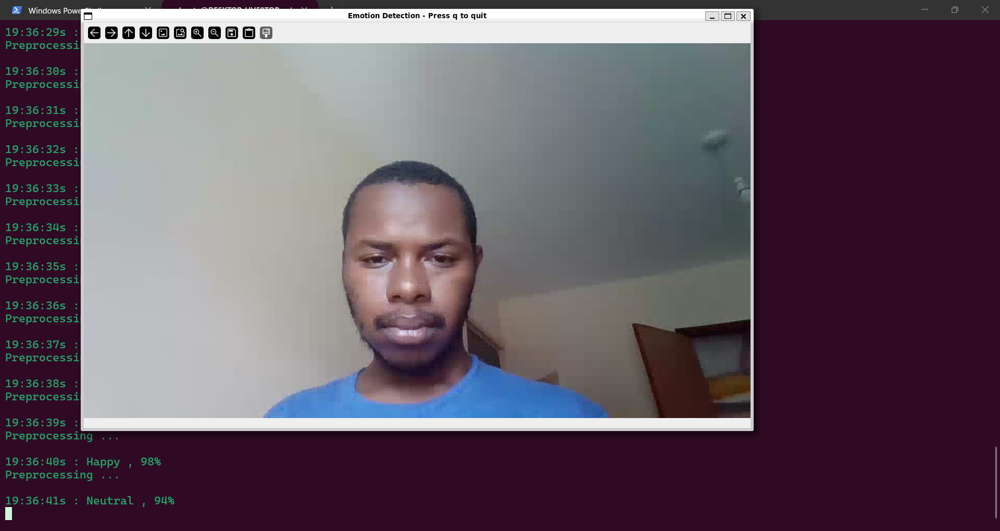
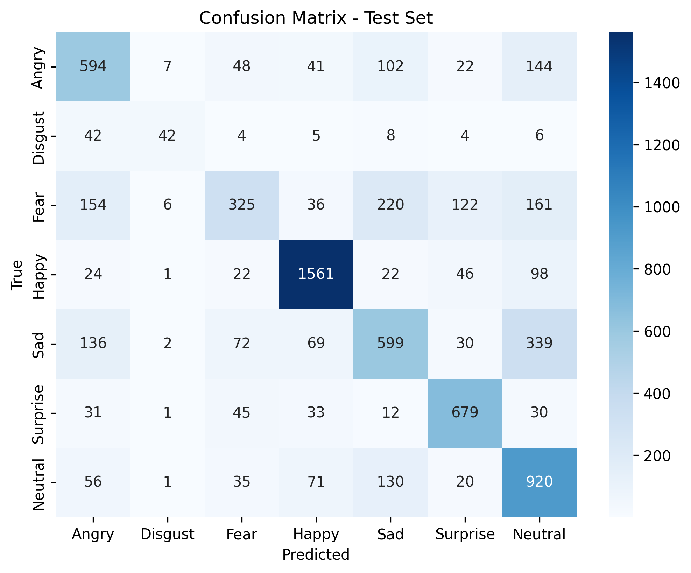

# Real-Time Facial Emotion Recognition

[](https://www.python.org/downloads/)
[](https://www.tensorflow.org/)
[](https://opencv.org/)
[](https://opensource.org/licenses/MIT)

This project implements a real-time facial emotion recognition system using a custom Convolutional Neural Network (CNN) built with TensorFlow and Keras. The system can classify emotions from a live webcam feed or a pre-recorded video file, leveraging OpenCV for video processing and face detection.



---

## Table of Contents

- Key Features
- Performance
- Model Architecture
- Project Structure
- Getting Started
  - Prerequisites
  - Installation
- Usage
  - Training the Model
  - Evaluating the Model
  - Running Real-Time Prediction
- Future Improvements
- License
- Acknowledgments

---

## Key Features

- **7 Emotion Classes**: Classifies faces into Angry, Disgust, Fear, Happy, Sad, Surprise, and Neutral.
- **Real-Time Detection**: Processes live video from a webcam or video file.
- **CNN from Scratch**: Uses a custom-built CNN, demonstrating model creation from the ground up.
- **Haar Cascade Face Detection**: Employs OpenCV's fast Haar Cascade classifier to locate faces in each frame.
- **Training Monitoring**: Integrated with TensorBoard for real-time visualization of training metrics.
- **Overfitting Prevention**: Implements Early Stopping, Model Checkpointing, and Dropout to build a robust model.

---

## Performance

The final model achieves a **test accuracy of over 65%** on the FER2013 dataset, meeting the project's primary goal.

### Learning Curves
The training history shows that `EarlyStopping` successfully halted training before significant overfitting occurred, as the validation loss began to plateau.


### Confusion Matrix
The confusion matrix highlights the model's performance across all seven emotion classes. "Happy" is the most accurately predicted emotion, while "Fear" and "Disgust" are more commonly confused with other emotions.



---

## Model Architecture

The final model is a VGG-style Convolutional Neural Network with multiple convolutional blocks designed to learn hierarchical features from the facial images.

- **Input**: 48x48x1 grayscale images, normalized to a [0, 1] range.
- **Convolutional Blocks**: Three blocks with increasing filter sizes (64 -> 128 -> 256) to capture features of varying complexity.
- **Activation**: `LeakyReLU` is used to prevent the "dying ReLU" problem.
- **Regularization**: `BatchNormalization`, `SpatialDropout2D` in convolutional blocks, and `Dropout` in the dense classifier head are used to combat overfitting.
- **Classifier**: A `GlobalAveragePooling2D` layer followed by a `Dense` classifier head outputs probabilities for the 7 emotion classes using a `softmax` activation function.

For a complete breakdown of the architecture, layers, parameters, and design choices, please see the detailed documentation:
[**Final Model Architecture Details**](results/model/final_emotion_model_arch.txt)

---

## Project Structure

```
facial-emotion-recognition/
├── data/    # (Must be downloaded manually)
│   ├── train.csv
│   ├── test.csv
│   └── test_with_emotions.csv
├── results/
│   ├── logs/             # TensorBoard logs
│   ├── model/            # Saved models, plots, and architecture docs
│   └── preprocessing_test/ # Output of the video preprocessing test
├── scripts/
│   ├── preprocess.py     # Data loading and preprocessing functions
│   ├── train.py          # Script to train the CNN model
│   ├── predict.py        # Script to evaluate model on the test set
│   └── predict_live_stream.py # Script for real-time prediction
├── .gitignore
├── issues.md
├── README.md
└── requirements.txt
```

---

## Getting Started

### Prerequisites
- Python 3.11+
- An environment manager like `venv` or `conda`.

### Installation

1.  **Clone the repository:**
    ```bash
    git clone https://github.com/stkisengese/facial-emotion-recognition.git
    cd facial-emotion-recognition
    ```

2.  **Create and activate a virtual environment:**
    ```bash
    # For Linux/macOS
    python3 -m venv cnn_env
    source cnn_env/bin/activate

    # For Windows
    python -m venv cnn_env
    .\cnn_env\Scripts\activate
    ```

3.  **Install the required dependencies:**
    ```bash
    pip install -r requirements.txt
    ```

4.  **Download the dataset:**
    Download the FER2013 dataset from Kaggle. Place the `train.csv` and `test.csv` files inside the `data/` directory.
```bash
wget https://assets.01-edu.org/ai-branch/project3/emotions-detector.zip
unzip emotions-detector.zip -d data/
```
---

## Usage

### Training the Model

To train the model from scratch, run the training script. Checkpoints of the best model will be saved in `results/model/`.

```bash
python scripts/train.py
```

You can monitor the training progress in real-time using TensorBoard:
```bash
tensorboard --logdir results/logs
```

### Evaluating the Model

To evaluate the final model's accuracy on the test set, run the prediction script:

```bash
python scripts/predict.py
```
Expected output:
```bash
Accuracy on test set: 62%
```

### Running Real-Time Prediction

To start real-time emotion detection using your default webcam:

```bash
python scripts/predict_live_stream.py
```

To use a video file as input instead:
```bash
python scripts/predict_live_stream.py /path/to/your/video.mp4
```

To run in a headless environment (like a server or WSL without a GUI) where windows cannot be displayed:
```bash
python scripts/predict_live_stream.py /path/to/your/video.mp4 --no-display
```

---

## Future Improvements

- **Transfer Learning**: Experiment with pre-trained models like VGG16 or ResNet50 (fine-tuned on the FER dataset) to potentially boost accuracy.
- **Adversarial Robustness**: Investigate the model's vulnerability to adversarial attacks (e.g., FGSM) and explore defensive techniques.
- **Prediction Smoothing**: Implement a moving average or a more advanced filter over the last few predictions to reduce output jitter.

---

## License
[MIT License](LICENSE) – feel free to use, modify, and learn from this project.
✉️ Contact / Connect

---

## Acknowledgments

- The FER2013 dataset was provided by the Kaggle "Challenges in Representation Learning" competition.
- This project was structured and guided by a comprehensive set of development tasks.